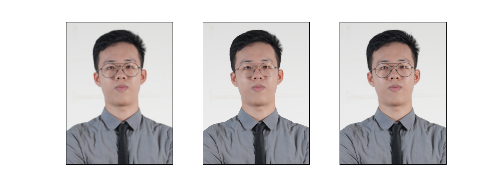

# cv110_hw2_D0748284

# 1. 放大圖片：40%
[resize 程式](hw2_resize.py)
## 1-1 最近鄰：20%
* 更改倍率:`scale_x,scale_y`
* function:`nearest_neighbor(input,scale_x,scale_y)`
* code:
    ``` python
    def nearest_neighbor(input,scale_x,scale_y):
        new_x = np.int16(input.shape[0]*scale_x)
        new_y = np.int16(input.shape[1]*scale_y)
        new_img = np.ones((new_x, new_y,input.shape[-1]),dtype=np.uint8)
        for i in range(new_img.shape[0]):
            x_near = np.int16(i/scale_x)
            for j in range(new_img.shape[1]):
                y_near = np.int16(j/scale_y)
                new_img[i,j,:] = input[x_near,y_near,:]
        return new_img
    ```
### Result


## 1-2 線性：20%
* 更改倍率:`scale_x,scale_y`
* function:`linear(input,scale_x,scale_y)`
* code:
    ``` python
    ## count weight index
    def linear_interpolation(A, B ,Y):
        return (Y-A)/abs(B-A)
    ```
    ``` python
    def linear (input,scale_x,scale_y):
        new_x = np.int16(input.shape[0]*scale_x)
        new_y = np.int16(input.shape[1]*scale_y)
        new_img = np.ones((new_x, new_y,input.shape[-1]),dtype=np.uint8)
        for i in range(new_img.shape[0]):
            x_near = i/scale_x
            xa_wegiht= linear_interpolation (np.int16(x_near),np.int16(x_near+1),x_near)
            for j in range(new_img.shape[1]):
                y_near = j/scale_y
                # if y_near %1 > 0.0:
                ya_wegiht= linear_interpolation (np.int16(y_near),np.int16(y_near+1),y_near)
                # new_input[i,j,:] = input[x_near,y_near,:]
                if (x_near+1) < input.shape[0] and (y_near+1) < input.shape[1]:
                    new_img[i,j,:] = (input[np.int16(x_near),np.int16(y_near),:]*xa_wegiht*ya_wegiht) \
                            + (input[np.int16(x_near+1),np.int16(y_near),:]*(1-xa_wegiht)*ya_wegiht) \
                            + (input[np.int16(x_near),np.int16(y_near+1),:]*(xa_wegiht)*(1-ya_wegiht)) \
                            + (input[np.int16(x_near+1),np.int16(y_near+1),:]*(1-xa_wegiht)*(1-ya_wegiht))
        return new_img
    ```
### Result


## 比較線性內插時從不同方向進行內插的結果:5%
> 計算權重公式: $(A * wegiht_{x}*wegiht_{y})+ (B * wegiht_{x}^* *wegiht_{y}) + (C * wegiht_{x} * wegiht_{y}^*) + (D * wegiht_{x}^* * wegiht_{y}^*)$ 

> 交換方向：$(A *wegiht_{y} * wegiht_{x})+ (B *wegiht_{y} * wegiht_{x}^* ) + (C  * wegiht_{y}^* * wegiht_{x}) + (D * wegiht_{y}^* * wegiht_{x}^*)$
> 計算結果可知兩者出來得結果"理論"相同


# 2.  模糊圖片：50%
[Blur 程式](hw2_Blur.py)
## Average Blur
* function:`AverageBlur(img, filter_size)`
* code:
    ``` python
    def AverageBlur(img,filter_size):
        convol_size = filter_size//2
        new_img = np.ones_like(img,dtype=np.uint8)
        filter=np.ones((filter_size,filter_size)) # Medium Blur
        filter_sum = np.sum(filter)
        for color_clannels in range(img.shape[-1]):
            for i in range(convol_size,img.shape[0]-convol_size):
                for j in range(convol_size,img.shape[1]-convol_size):
                    new_img[i,j,color_clannels] = np.sum((img[i-convol_size:i+1+convol_size,j-convol_size:j+1+convol_size,color_clannels]*filter)) \
                        / (filter_sum)
    return new_img
    ```
### Result
<!-- * use 7*7 Average filter
 -->
* use 5*5 Average filter

<!-- * use 5*5 Average filter
 -->

## Medium Blur

* function:`MediumBlur(img, filter_size)`
* code:
    ``` python
    def MediumBlur(img,filter_size):
        convol_size = filter_size//2
        new_img = np.ones_like(img,dtype=np.uint8)
        filter=np.ones((filter_size,filter_size)) # Medium Blur
        for color_clannels in range(img.shape[-1]):
            for i in range(convol_size,img.shape[0]-convol_size):
                for j in range(convol_size,img.shape[1]-convol_size):
                    new_img[i,j,color_clannels] = \
                        np.median((img[i-convol_size:i+1+convol_size,\
                            j-convol_size:j+1+convol_size,color_clannels]*filter))
    return new_img
    ```

### Result
<!-- * use 7*7 Medium filter

* use 5*5 Medium filter -->

<!-- * use 5*5 Medium filter
 -->

## Gaussian Blur

* function:`GaussianBlur(img, filter_size)`
* code:
    ``` python
    ## get gaussian index
    def gaussian (x,mean=0,std=1):
        return ((math.sqrt(2*math.pi)*std)**-1)* math.exp(-0.5*((((x-mean)/std)**2)))

    def GaussianBlur(img,filter_size,mean=0,std=1):
        filter=np.ones((filter_size,filter_size))
        convol_size = filter_size//2
        new_img = np.ones_like(img,dtype=np.uint8)
        for i in range(filter.shape[0]):
            for j in range(filter.shape[1]):
                filter[i,j]=gaussian(np.sqrt((i-convol_size)**2 + (j-convol_size)**2) ,mean,std)
        filter = filter/np.sum(filter)
        filter = np.int32((filter/filter[0,0]))
        filter_sum = np.sum(filter)
        for color_clannels in range(img.shape[-1]):
            for i in range(convol_size,img.shape[0]-convol_size):
                for j in range(convol_size,img.shape[1]-convol_size):
                    new_img[i,j,color_clannels] = np.sum((img[i-convol_size:i+1+convol_size,j-convol_size:j+1+convol_size,color_clannels]*filter)) \
                        / (filter_sum)
        return new_img
    ```


### Result
<!-- * use 7*7 Gaussian filter
 -->
* use 5*5 Gaussian filter

## 比較分析三種模糊方法在人臉照片下的差別:5%

### Result


* 由左至右分別為 AverageBlur,MediumBlur,GaussianBlur
> 藉由比較結果可以看出在AverageBlur中人臉和背景全部模糊(馬賽克)，而在MediumBlur中人臉會整個區塊有打磨風格(賽璐璐風)，而在GaussianBlur中人臉特徵會是最清楚的。

# bouns sign name  10%


new_img = sign(new_img)
``` python
def sign(src,threshold=128):
    name_img = cv2.imread("name.jpeg",0)
    ## resize incase name image bigger than background image
    name_img = cv2.resize(name_img,(src.shape[0]//2,src.shape[1]//2))
    for i in range(name_img.shape[0]):
        for j in range(name_img.shape[1]):
            ## use threshold to remove background
            if name_img[i,j] < threshold:
                src[name_img.shape[0]+i,name_img.shape[1]+j,:] = [255,255,255]
    return src
```

## 心得討論
這次的作業用python 寫的話執行速度會非常的慢，尤其在做高斯的地方，然後再寫高斯的時候忘記老師說可以用函示，還自己搞了高斯的遮罩(感謝機率老師)，花了滿多時間的，然後這次的作業感覺比上學期電腦視覺的作業簡單不少，希望之後不要太難