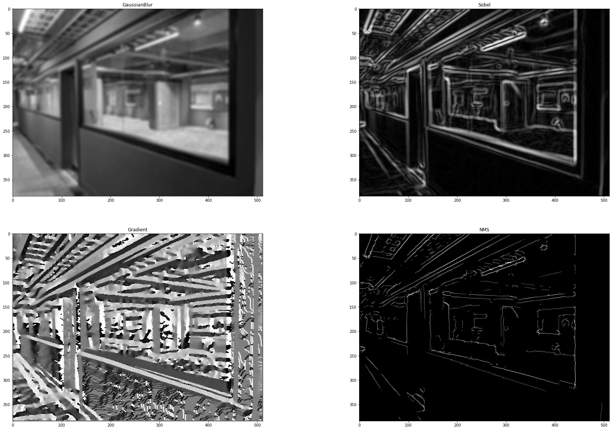
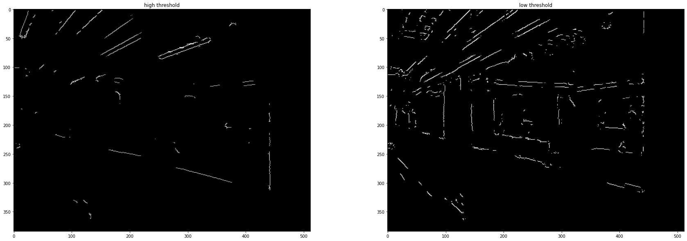
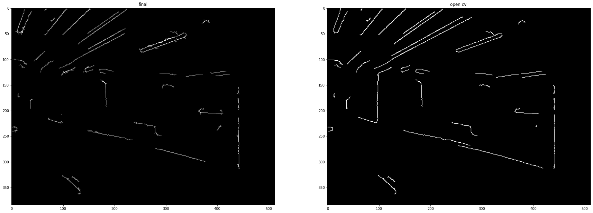
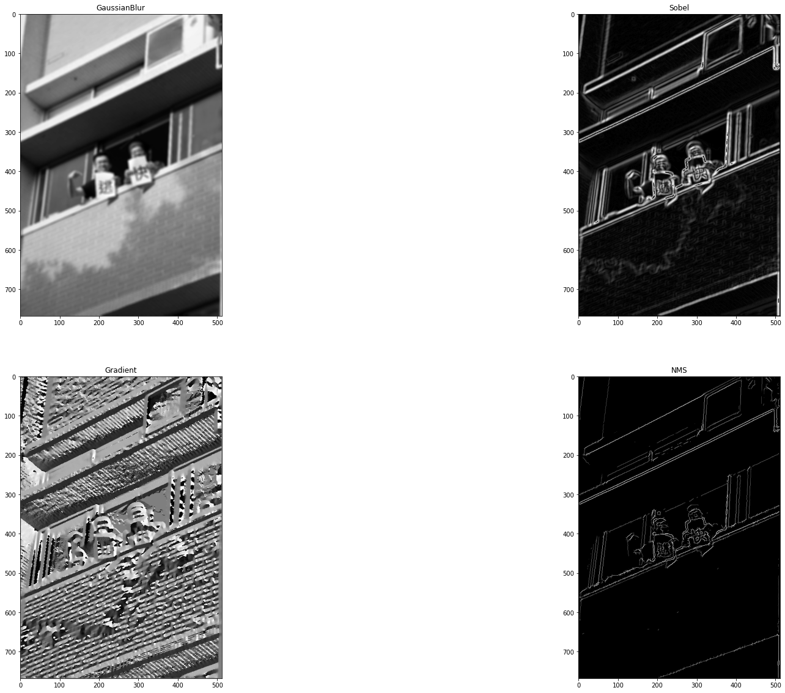
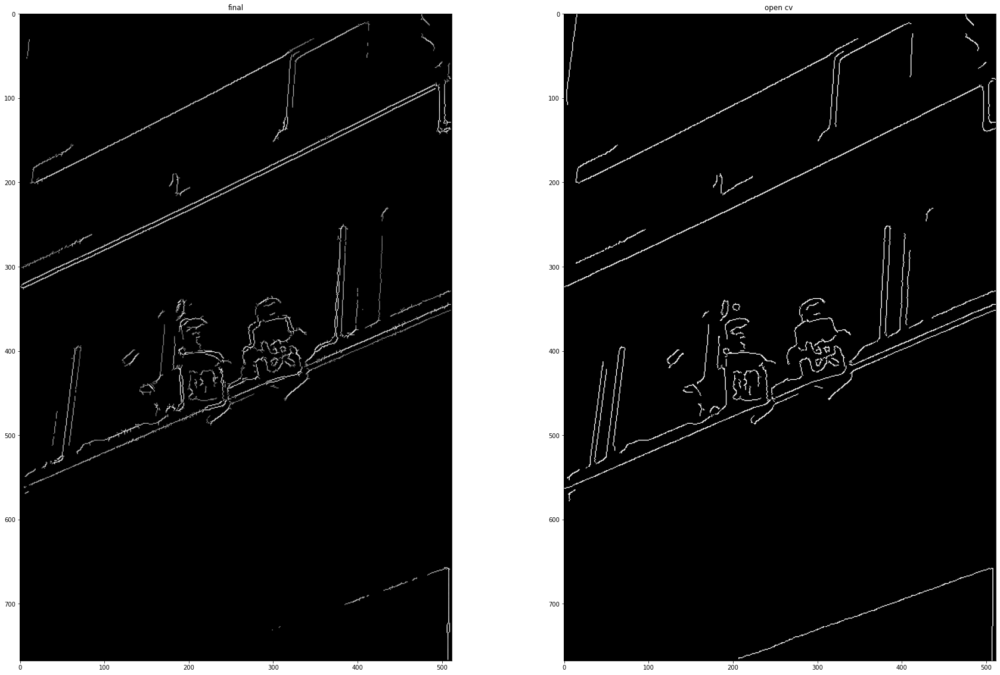
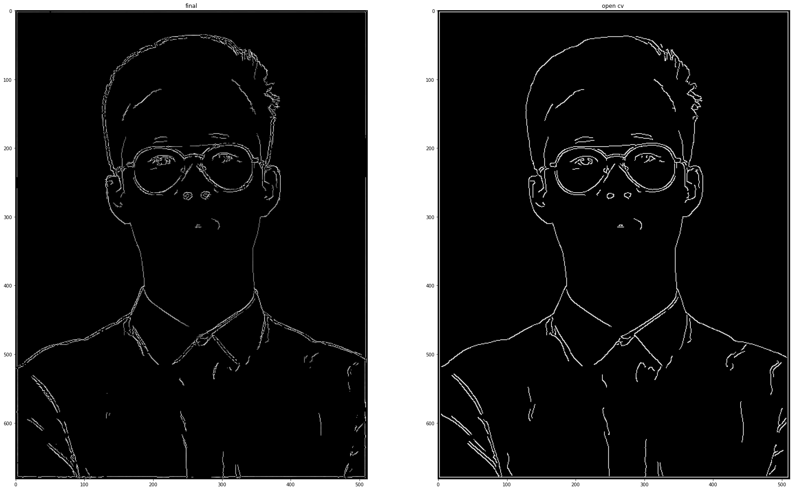
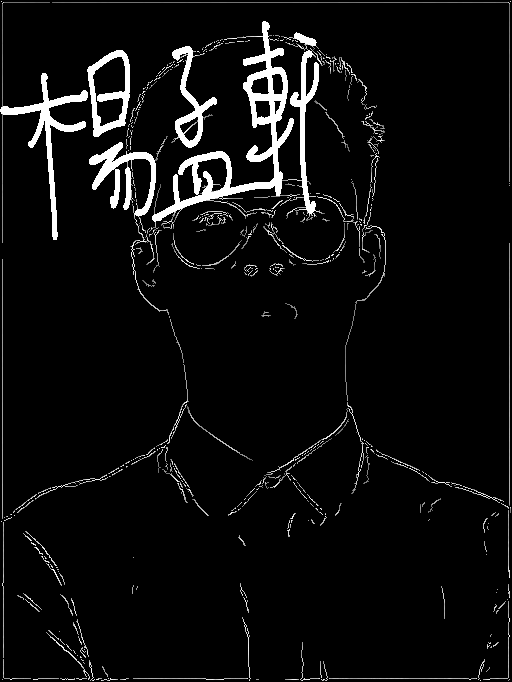

# CV110 final D0748284
###### tags: `CV`

---

[canny edge](https://colab.research.google.com/drive/1UzVfnPUIvam08lrM5nY872Ov12rLcheI?usp=sharing)

## input image 1

### image GaussianBlur,Sobel,Gradient,NMS

### 信任區間過濾

### Result (my vs cv2)

### Hough_Transform

---

## input image 2

### image GaussianBlur,Sobel,Gradient,NMS

### Result (my vs cv2)

### Hough_Transform

## face

### Result (my vs cv2)

### sign

