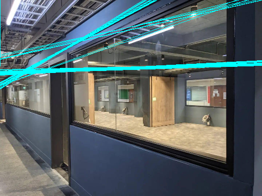
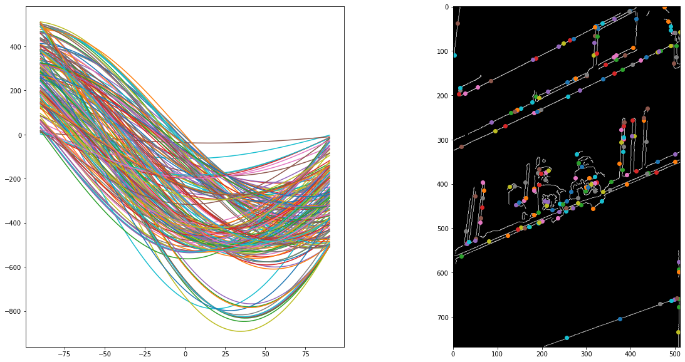

# CV110 final D0748284
###### tags: `CV`

---

[canny edge](https://colab.research.google.com/drive/1UzVfnPUIvam08lrM5nY872Ov12rLcheI?usp=sharing)


## input image 1


### image GaussianBlur,Sobel,Gradient,NMS


### 信任區間過濾


### Result (my vs cv2)


### Hough_Transform


---

## input image 2


### image GaussianBlur,Sobel,Gradient,NMS


### Result (my vs cv2)


### Hough_Transform



## face

### Result (my vs cv2)


### sign


---

# Canny Edge


## sobel M(x,y)

``` python
def sobel(img , T = False):
    new_img = np.zeros_like(img,dtype=np.float32)
    filter = np.array([[-1,0,1],[-2,0,2],[-1,0,1]]) #sobel
    # filter = np.array([[-1,0,1],[-1,0,1],[-1,0,1]]) #Prewitt
    # filter = np.array([[-3,0,3],[-10,0,10],[-3,0,3]]) #Scharr
    if T :
        filter = np.transpose(filter)
    # print(filter)
    for i in range(1,img.shape[0]-1):
        for j in range(1,img.shape[1]-1):
            result = np.sum((img[i-1:i+2,j-1:j+2]*filter))
            new_img[i,j] = result
            # if result < 0:
            # new_img[i,j] = np.abs(result)
    return new_img

def Finding_intensity_gradient(img_x , img_y):
    intensity = np.zeros_like(img_x,dtype=np.uint8)
    gradient = np.zeros_like(img_x,dtype=np.float32)
    for i in range(1,intensity.shape[0]-1):
        for j in range(1,intensity.shape[1]-1):
            # intensity[i,j] =  np.sqrt(img_x[i,j]**2 + img_y[i,j]**2)
            intensity[i,j] =  np.abs(img_x[i,j]) + np.abs(img_y[i,j])
            gradient[i,j] =  np.arctan2(img_y[i,j] ,img_x[i,j]) # np.arctan2([y-coordinates , x-coordinates])
    return intensity,gradient
Sobel_y = sobel(img , True) # y
Sobel_x = sobel(img ) # x
```
`new_img_I ,new_img_G = Finding_intensity_gradient(Sobel_x , Sobel_y) `


## Non-Maximum Suppression

### 將角度先換成方向(1~4)
``` python
def get_Gradinent_map(img_G):
    Gradinent_map = np.zeros_like(img_G)
    # img_G = np.abs(img_G)
    for i in range(1,img_G.shape[0]-1):
        for j in range(1,img_G.shape[1]-1):
            if np.abs(img_G[i,j]) <= np.pi/8 or np.abs(img_G[i,j]) > (7*np.pi)/8:
                Gradinent_map[i,j] = 2
            elif np.abs(img_G[i,j]) >= (3*np.pi)/8 and np.abs(img_G[i,j]) < (5*np.pi)/8:
                Gradinent_map[i,j] = 1
            elif (img_G[i,j] >= (np.pi)/8 and img_G[i,j] < (3*np.pi)/8)or\
                (img_G[i,j] <= -(5*np.pi)/8 and img_G[i,j] > -(7*np.pi)/8):
                Gradinent_map[i,j] = 3
            elif (img_G[i,j] >= (5*np.pi)/8 and img_G[i,j] < (7*np.pi)/8) or\
                ((img_G[i,j] <= -(np.pi)/8 and img_G[i,j] > -(3*np.pi)/8)) :
                Gradinent_map[i,j] = 4
    return Gradinent_map
```

### 沿著方向做NMS
``` python
def Non_Maximum_Suppression(img,map):
    reuslt_img = np.zeros_like(img)
    # for i in range(1,img.shape[0]-1):
    #     for j in range(1,img.shape[1]-1):
    for i,j in zip(np.nonzero(map)[0],np.nonzero(map)[1]) :
        if map[i,j] == 1:
            x,y = [i+1,j]
            while (map[x,y] == map[i,j] and x0 and y>0 and x threshold1 , nms_img , 0)
low_img = np.where( nms_img > threshold2 , nms_img , 0) 
low_img = np.where( low_img < threshold1 , low_img , 0) 
```

### 連通成份
``` python
def find_connect_pixel_map(high , low ,filter_size = 3):
    filter = np.ones((filter_size,filter_size),dtype=np.uint8) # 8連通
    # filter = np.array([[0,1,0],[1,0,1],[0,1,0]])# 4連通
    f = filter_size//2
    walk_map = np.where(high == 0 , high , 255)
    map = np.zeros_like(img , dtype=np.int8) 
    for i in range(f,walk_map.shape[0]-f):
        for j in range(f,walk_map.shape[1]-f):
            if walk_map[i,j] >0:
                # find neighbor 
                # because none of low_img pixel superimposition to high_img so the middle of filter can be 1
                if np.sum(low[i-f : i+f+1 , j-f:j+f+1 ] * filter) >0:
                    map[i,j] = 1
    return map


# from connect map find connect pixel in low threshold image
# @jit(nopython=True)
def new_connect_img(map,source_img , filter_size = 3):
    img = np.zeros_like(source_img)
    filter = np.ones((filter_size,filter_size),dtype=np.uint8) # 8連通
    # filter = np.array([[0,1,0],[1,0,1],[0,1,0]]) # 4連通
    f = filter_size//2
    for i,j in zip(np.nonzero(map)[0],np.nonzero(map)[1]) :
        img[i-f : i+1+f,j-f : j+1+f] = source_img[i-f : i+1+f,j-f : j+1+f] * filter
    return img

# @jit(nopython=True)
def Iteration_connect_pixel(high_threshold_img,low_threshold_img,filter_size=3):
    count = 0 #看有幾次迭代
    connect = np.ones_like(high_threshold_img)
    while connect.sum() > 0:
        map = find_connect_pixel_map(high_threshold_img,low_threshold_img,filter_size)
        ## iteration high image from 
        connect = new_connect_img(map,low_threshold_img,filter_size)
        # print(connect.sum())
        high_threshold_img = high_threshold_img + connect
        low_threshold_img = low_threshold_img - connect
        count +=1 #看有幾次迭代
    print("Iteration times: " ,count)
    return high_threshold_img
```

## 簽名
``` python
def sign(src,threshold=128):
    name_img = cv2.imread("name.jpeg",0)
    name_img = cv2.resize(name_img,(src.shape[0]//2,src.shape[1]//2))
    for i in range(name_img.shape[0]):
        for j in range(name_img.shape[1]):
            if name_img[i,j] < threshold:
                # src[name_img.shape[0]+i,name_img.shape[1]+j] = 255
                src[i,j] = 255
                # print( src[name_img.shape[0]+i,name_img.shape[1]+j] )
    return src
```

# Hough

## 轉換並繪圖
``` python
j=0
for x,y in sample:
    for i in np.arange(0,181):
        r[i,j] =( (x * np.cos(np.deg2rad(i-90))) + (y * np.sin(np.deg2rad(i-90))) )
        # r[i,j] =( (x * np.cos(np.deg2rad(i))) + (y * np.sin(np.deg2rad(i))) )
    plt.plot(np.arange(-90,91) , -(r[:,j])) #y 的正負反了 調不過來
    j+=1

```

## 完成Hough Transform畫出線段圖

投票的時候記得附近ϴρ都要投，不要只投給剛剛好的ϴρ

1. 找到交點然後座標轉換：$y=-cot \theta * a + \frac{\rho}{sin\theta}$
2. 用直線座標公式找頂點(邊界)座標

``` python

def x0_y0(rho,theta):
    # print(rho,theta)
    theta = np.round(theta)
    cos = np.round(np.cos(np.deg2rad(theta)) , decimals=2)
    sin = np.round(np.sin(np.deg2rad(theta)) , decimals=2)
    if cos != 0 and sin != 0:
        return rho/cos , rho/sin
    elif cos == 0 and sin !=0 :
        return 0, rho/sin
    elif sin == 0 and cos !=0 :
        return rho/cos , 0

img = cv2.imread(img_name) # load image
img = cv2.resize(img , (512,np.int((img.shape[0]/img.shape[1])*512)))

for rho,theta in high_threshold_point:
    y0,x0 = x0_y0(rho-abs(r.min()),theta-90)
    x0 = np.int(x0)
    y0 = np.int(y0)
    img = cv2.line(img, (x0,0), (0,y0) , (255,255,0))
```

# 心得
我覺得電腦視覺的作業比較難，今年要畢業了希望給老師下屆出的作業可以再難一點