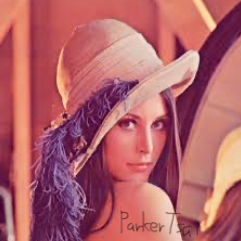
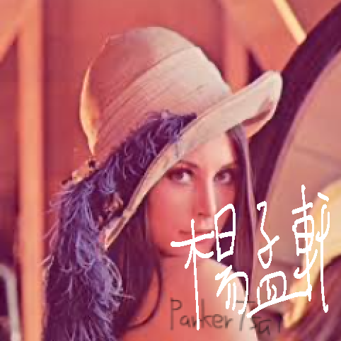

# cv110_hw2_D0748284

原始圖片

# 1. 放大圖片：40%
## 1-1 最近鄰：20%
* [code](hw2_1_1.py)
* 更改倍率:`scale = 11.1 # scale of new image`
### Result


## 1-2 線性：20%
* [code](hw2_1_2.py)
* 更改倍率:`scale = 11.1 # scale of new image`
### Result


# 2.  模糊圖片：50%


# bouns sign name  15%

new_img = sign(new_img)

``` python
def sign(src,threshold=128):
    name_img = cv2.imread("name.jpeg",0)
    name_img = cv2.resize(name_img,(src.shape[0]//2,src.shape[1]//2))
    for i in range(name_img.shape[0]):
        for j in range(name_img.shape[1]):
            if name_img[i,j] < threshold:
                src[name_img.shape[0]+i,name_img.shape[1]+j,:] = [255,255,255]
    return src
```
